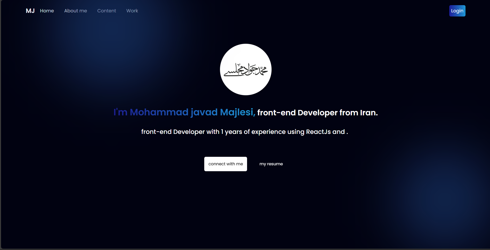
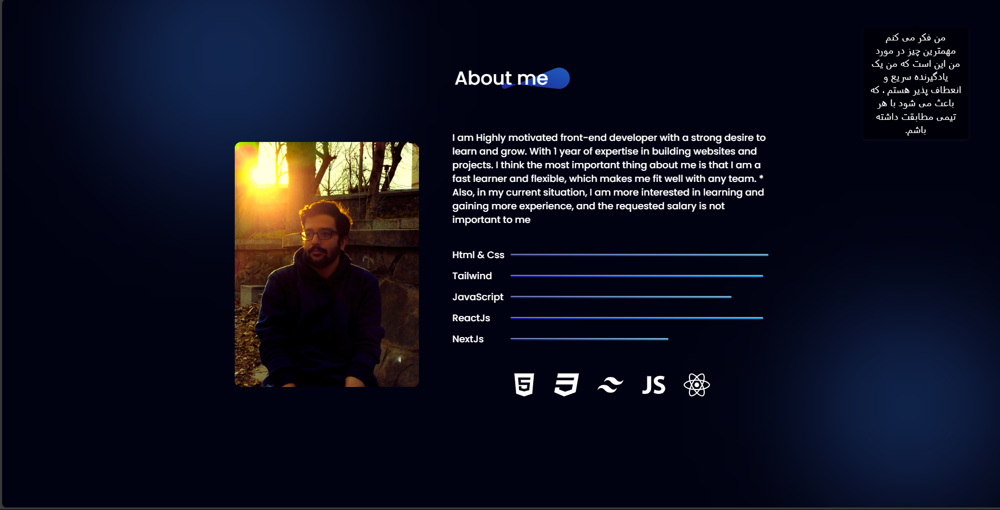
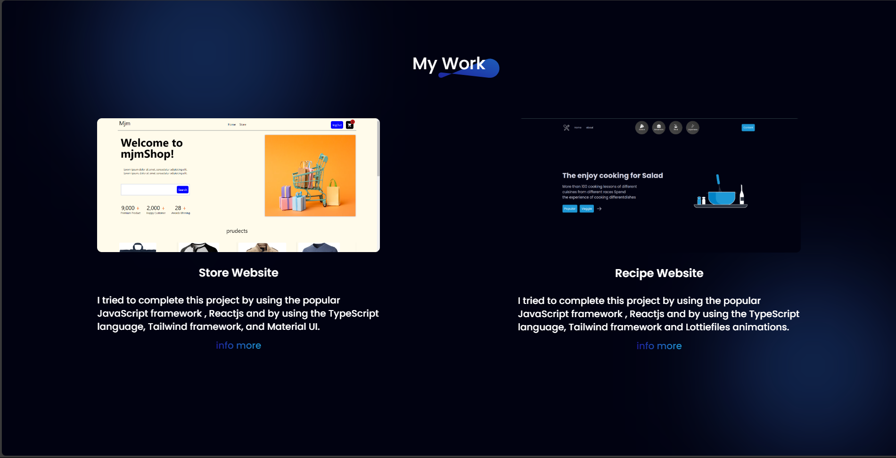

# Portfolio Website

## Website Link
`https://mjmajlesi.github.io/portfoilo-website/`

## Photos




## Introduction

This site is about me. In this site, I was able to create a beautiful site about myself using React frameworks and libraries.
I also used animations and visual effects to beautify the website.
You can also view my portfolio on this site and refer to the related repository.

link website : `https://mjmajlesi.github.io/portfoilo-website/`

---

## Features

- Fast and responsive user interface
- Component-based architecture for easier maintenance
- Use of styled-components , Tailwindcss for CSS
- Use of framer-motion and react-type-animation for animation

---

## 🛠 install and run

```bash
git clone https://github.com/mjmajlesi/portfoilo-website.git
cd portfoilo-website
npm install
npm run dev
